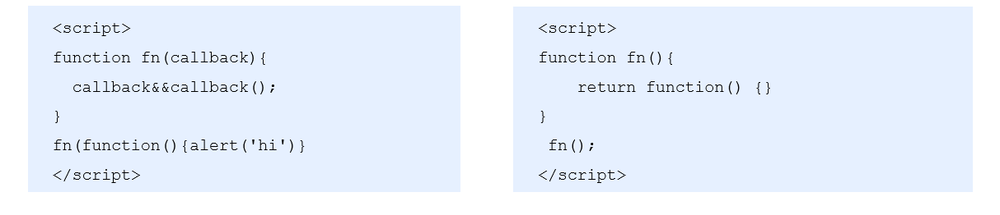

# this指向

**【this在没有调用的时候是没有任何意义，只有在调用的时候才有意思，谁调用this就指向谁】**

这些 this 的指向，是当我们调用函数的时候确定的。调用方式的不同决定了this 的指向不同

一般指向我们的调用者.


## 改变this指向

### call（）方法 	 ES5中的继承

- call()方法调用一个对象。简单理解为调用函数的方式，但是它可以改变函数的 this 指向
- **语法：apply(对象,  arg1,arg2,arg3.......)**

```js
var o = {
	name: 'andy'
}
 function fn(a, b) {
      console.log(this);
      console.log(a+b)
};
fn(1,2)// 此时的this指向的是window 运行结果为3
fn.call(o,1,2)//此时的this指向的是对象o,参数使用逗号隔开,运行结果为3
```

### apply（）方法	数组

- apply() 方法调用一个函数。简单理解为调用函数的方式，但是它可以改变函数的 this 指向。
- **语法：apply(对象,  [多个参数])**

```js
var o = {
	name: 'andy'
}
 function fn(a, b) {
      console.log(this);
      console.log(a+b)
};
fn()// 此时的this指向的是window 运行结果为3
fn.apply(o,[1,2])//此时的this指向的是对象o,参数使用数组传递 运行结果为3
```

### bind（）方法	不调用函数

- ind() 方法不会调用函数,但是能改变函数内部this 指向,返回的是原函数改变this之后产生的新函数
- 如果只是想改变 this 指向，并且不想调用这个函数的时候，可以使用bind

```js
 var o = {
 name: 'andy'
 };

function fn(a, b) {
	console.log(this);
	console.log(a + b);
};
var f = fn.bind(o, 1, 2); //此处的f是bind返回的新函数
f();//调用新函数  this指向的是对象o 参数使用逗号隔开
```

### 三者的异同

- 共同点 : 都可以改变this指向
- 不同点:
  - call 和 apply  会调用函数, 并且改变函数内部this指向.
  - call 和 apply传递的参数不一样,call传递参数使用逗号隔开,apply使用数组传递
  - bind  不会调用函数, 可以改变函数内部this指向.

- 应用场景
  1. call 经常做继承. 
  2. apply经常跟数组有关系.  比如借助于数学对象实现数组最大值最小值
  3. bind  不调用函数,但是还想改变this指向. 比如改变定时器内部的this指向. 

# 高阶函数

- 高阶函数是对其他函数进行操作的函数，它接收函数作为参数或将函数作为返回值输出。



- 此时fn 就是一个高阶函数

- 函数也是一种数据类型，同样可以作为参数，传递给另外一个参数使用。最典型的就是作为回调函数。

- 同理函数也可以作为返回值传递回来

# 闭包

**作用：延伸变量的作用范围。**

```js
<script>
    function fn1() {//fn1就是闭包函数
        var num = 66;
        function fn2() {
            console.log(num);//66
            
        }
        fn2();
    }
</script>
```

## 案例

- **利用闭包的方式得到当前li 的索引号**

```js
    for (var i = 0; i < lis.length; i++) {
    // 利用for循环创建了4个立即执行函数
    // 立即执行函数也成为小闭包因为立即执行函数里面的任何一个函数都可以使用它的i这变量
    (function(i) {
        lis[i].onclick = function() {
          console.log(i);
        }
     })(i);
    }
```

- **闭包应用-3秒钟之后,打印所有li元素的内容**

```js
    for (var i = 0; i < lis.length; i++) {
        (function(i) {
            setTimeout(function() {
                console.log(lis[i].innerHTML);
            }, 3000)
        })(i);
    }
```

- **闭包应用-计算打车价格** 

```js
    //打车起步价13(3公里内),  之后每多一公里增加 5块钱.  用户输入公里数就可以计算打车价格
    //如果有拥堵情况,总价格多收取10块钱拥堵费*/

    var car = (function() {
        var start = 13; // 起步价  局部变量
        var total = 0; // 总价  局部变量
        return {
            // 正常的总价
            price: function(n) {
                if (n <= 3) {
                    total = start;
                } else {
                    total = start + (n - 3) * 5
                }
                return total;
            },
            // 拥堵之后的费用
            yd: function(flag) {
                return flag ? total + 10 : total;
            }
        }
    })();
    console.log(car.price(5)); // 23
    console.log(car.yd(true)); // 33
```

- **闭包的应用**

```js
    var object = {
        name: "My Object",
        getNameFunc: function() {
            return function() {
                return this.name;
            };
        }
    };
    console.log(object.getNameFunc()())
        -----------------------------------------------------------------------------------
        var name = "The Window";　　
    var object = {　　　　
        name: "My Object",
        getNameFunc: function() {
            var that = this;
            return function() {
                return that.name;
            };
        }
    };
    console.log(object.getNameFunc()())
```


# 递归

**递归：**如果一个函数在内部可以调用其本身，那么这个函数就是递归函数。**简单理解:函数内部自己调用自己, 这个函数就是递归函数**

**注意：**递归函数的作用和循环效果一样，由于递归很容易发生“栈溢出”错误（stack overflow），**所以必须要加退出条件return**。

### 递归的案例

#### 利用递归求1~n的阶乘

```js
     function fn(n) {
         if (n == 1) { //结束条件
           return 1;
         }
         return n * fn(n - 1);
     }
     console.log(fn(3));
```

#### 利用递归求斐波那契数列

```js
    // 利用递归函数求斐波那契数列(兔子序列)  1、1、2、3、5、8、13、21...
    // 用户输入一个数字 n 就可以求出 这个数字对应的兔子序列值
    // 我们只需要知道用户输入的n 的前面两项(n-1 n-2)就可以计算出n 对应的序列值
    function fb(n) {
      if (n === 1 || n === 2) {
            return 1;
      }
      return fb(n - 1) + fb(n - 2);
    }
    console.log(fb(3));
```

#### 利用递归遍历数据

```js
    // 我们想要做输入id号,就可以返回的数据对象
     var data = [{
       id: 1,
       name: '家电',
       goods: [{
         id: 11,
         gname: '冰箱',
         goods: [{
           id: 111,
           gname: '海尔'
         }, {
           id: 112,
           gname: '美的'
         },

                ]

       }, {
         id: 12,
         gname: '洗衣机'
       }]
     }, {
       id: 2,
       name: '服饰'
    }];
    //1.利用 forEach 去遍历里面的每一个对象
     function getID(json, id) {
       var o = {};
       json.forEach(function(item) {
         // console.log(item); // 2个数组元素
         if (item.id == id) {
           // console.log(item);
           o = item;

           // 2. 我们想要得里层的数据 11 12 可以利用递归函数
           // 里面应该有goods这个数组并且数组的长度不为 0 
         } else if (item.goods && item.goods.length > 0) {
           o = getID(item.goods, id);
         }
       });
       return o;
    }
```

